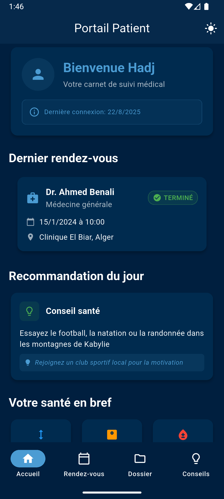
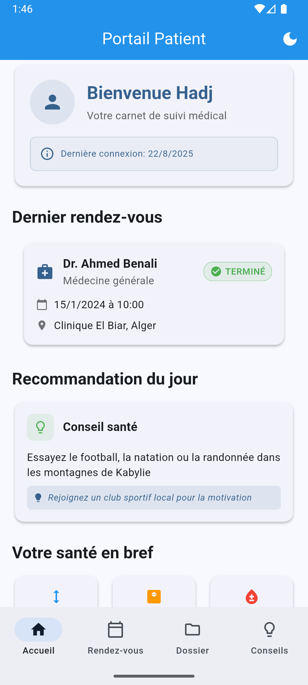
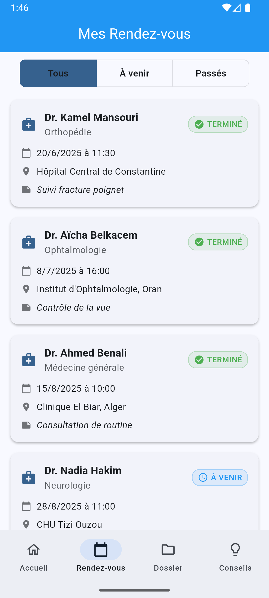
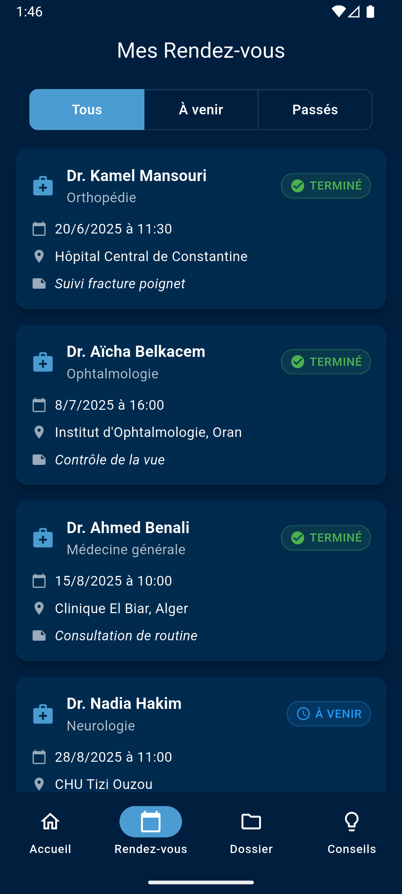
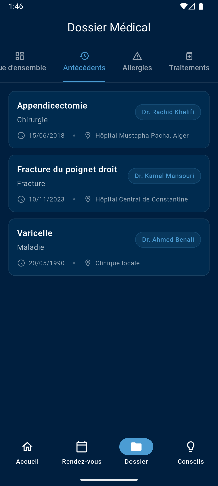
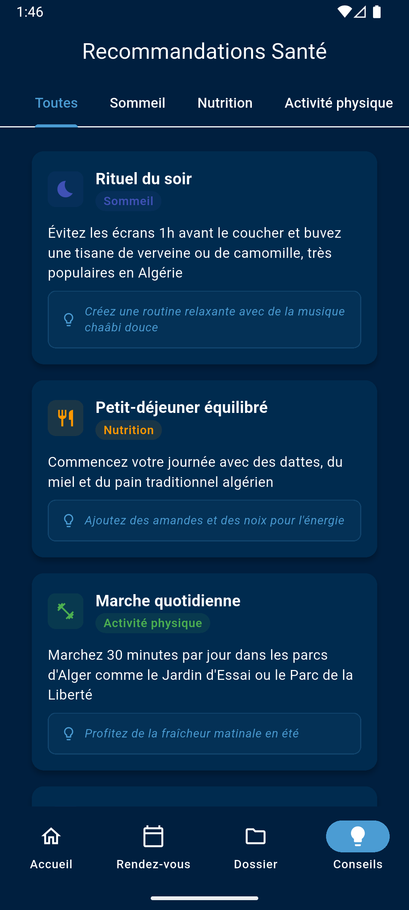
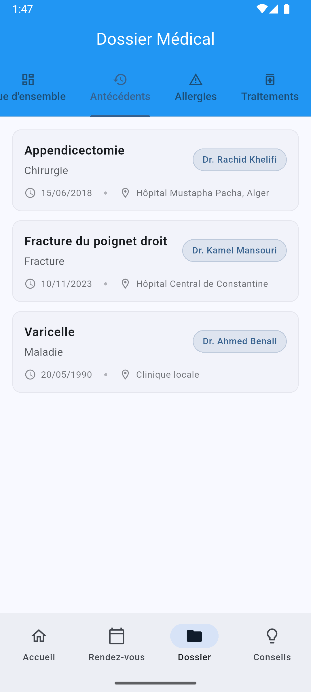
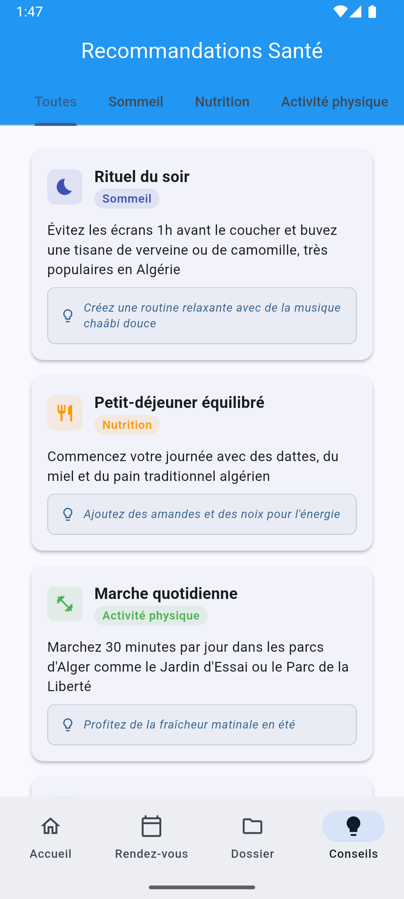

PORTAIL PATIENT - CARNET DE SUIVI MÉDICAL

Application mobile développée avec Flutter pour le suivi médical personnel des patients. Cette application permet aux utilisateurs de gérer leurs rendez-vous médicaux, consulter leur dossier médical et recevoir des recommandations de santé personnalisées.

OBJECTIFS DE L'APPLICATION

L'application Portail Patient a été conçue pour répondre aux besoins suivants :

Centralisation des informations médicales
- Regrouper toutes les informations médicales du patient en un seul endroit
- Faciliter l'accès aux données personnelles de santé
- Permettre un suivi continu de l'état de santé

Gestion des rendez-vous médicaux
- Visualiser l'historique complet des consultations
- Suivre les rendez-vous à venir et passés
- Accéder rapidement aux détails des consultations

Recommandations personnalisées
- Recevoir des conseils de santé adaptés
- Bénéficier de recommandations quotidiennes
- Améliorer les habitudes de vie grâce aux suggestions

Interface utilisateur moderne
- Profiter d'une expérience utilisateur intuitive
- Basculer entre thème clair et sombre selon les préférences
- Navigation fluide entre les différentes sections

FONCTIONNALITÉS PRINCIPALES

Écran d'accueil personnalisé
- Message de bienvenue avec le prénom du patient
- Affichage du dernier rendez-vous médical
- Recommandation de santé quotidienne
- Statistiques rapides (taille, poids, groupe sanguin)
- Indicateur de dernière connexion

Gestion des rendez-vous
- Liste complète des rendez-vous médicaux
- Filtrage par statut (tous, à venir, passés)
- Détails complets pour chaque consultation
- Informations sur le médecin et la spécialité
- Statut et lieu de chaque rendez-vous

Dossier médical
- Consultation des informations personnelles
- Historique médical détaillé
- Données biométriques du patient
- Informations de contact actualisées

Recommandations de santé
- Conseils quotidiens personnalisés
- Suggestions d'amélioration du mode de vie
- Recommandations basées sur le profil médical
- Interface attractive avec icônes explicatives

Thème adaptatif
- Mode clair et sombre disponibles
- Basculement instantané entre les thèmes
- Interface cohérente sur tous les écrans
- Préférences sauvegardées automatiquement

ARCHITECTURE TECHNIQUE

Technologies utilisées
- Framework : Flutter 3.9.0
- Langage : Dart
- Gestion d'état : Provider
- Navigation : GoRouter
- Stockage local : SharedPreferences
- Animations : Flutter Hooks

Structure du projet
- lib/main.dart : Point d'entrée et configuration de navigation
- lib/screens/ : Écrans principaux de l'application
- lib/models/ : Modèles de données (Patient, RendezVous, Recommandation)
- lib/services/ : Services (chargement de données, thème)
- lib/widgets/ : Composants réutilisables
- assets/ : Fichiers JSON de données de test

Patterns architecturaux
- Architecture MVVM avec Provider
- Séparation des responsabilités
- Composants réutilisables
- Gestion centralisée du thème

PRÉREQUIS SYSTÈME

Environnement de développement
- Flutter SDK version 3.9.0 ou supérieure
- Dart SDK compatible
- Android Studio ou Visual Studio Code
- Émulateur Android ou appareil physique

Dépendances principales
- flutter : SDK de base
- provider : Gestion d'état réactive
- go_router : Navigation déclarative
- shared_preferences : Stockage des préférences
- flutter_hooks : Hooks pour les animations
- cupertino_icons : Icônes iOS

Plateformes supportées
- Android (API niveau 21+)
- iOS (version 11.0+)
- Web (support expérimental)
- Windows, macOS, Linux (support desktop)

INSTRUCTIONS D'INSTALLATION

Étape 1 : Préparation de l'environnement
Vérifiez que Flutter est correctement installé sur votre système :
flutter doctor

Cette commande affichera l'état de votre installation Flutter et les éventuels problèmes à résoudre.

Étape 2 : Récupération du projet
Clonez ou téléchargez le projet dans le répertoire de votre choix.

Étape 3 : Installation des dépendances
Naviguez vers le répertoire du projet et exécutez :
flutter pub get

Cette commande téléchargera toutes les dépendances nécessaires au projet.

Étape 4 : Vérification de la configuration
Assurez-vous qu'un émulateur est en cours d'exécution ou qu'un appareil physique est connecté :
flutter devices

INSTRUCTIONS D'EXÉCUTION

Lancement en mode développement
Pour démarrer l'application en mode debug :
flutter run

L'application se lancera automatiquement sur l'appareil ou l'émulateur disponible.

Lancement avec rechargement à chaud
Le rechargement à chaud est activé par défaut en mode debug. Appuyez sur 'r' dans le terminal pour recharger l'application après modification du code.

Compilation pour la production
Pour générer un APK Android :
flutter build apk --release

Pour générer un bundle Android :
flutter build appbundle --release

Pour iOS (nécessite un Mac avec Xcode) :
flutter build ios --release

Lancement sur une plateforme spécifique
Pour Android uniquement :
flutter run -d android

Pour le web :
flutter run -d chrome

CAPTURES D'ÉCRAN DE L'APPLICATION

L'application présente une interface moderne et intuitive. Voici les principales vues :

Écran d'accueil

L'écran d'accueil affiche un message de bienvenue personnalisé avec le prénom du patient, les informations du dernier rendez-vous médical, une recommandation de santé quotidienne et un résumé des données biométriques.

Navigation principale

La barre de navigation inférieure permet d'accéder facilement aux quatre sections principales : Accueil, Rendez-vous, Dossier et Conseils.

Gestion des rendez-vous

L'écran des rendez-vous présente la liste complète des consultations avec possibilité de filtrage par statut. Chaque rendez-vous affiche les informations essentielles : médecin, spécialité, date et lieu.

Filtrage des rendez-vous

Les onglets de filtrage permettent de visualiser tous les rendez-vous, uniquement ceux à venir ou l'historique des consultations passées.

Dossier médical

Le dossier médical centralise toutes les informations personnelles du patient : données biométriques, informations de contact et historique médical.

Recommandations de santé

L'écran des recommandations propose des conseils de santé personnalisés avec des descriptions détaillées et des suggestions pratiques.

Mode sombre

L'application supporte le mode sombre pour une utilisation confortable dans toutes les conditions d'éclairage.

Interface adaptative

L'interface s'adapte automatiquement aux préférences de thème du système et permet un basculement manuel entre les modes clair et sombre.

STRUCTURE DES DONNÉES

Format des données patient
Les informations patient sont stockées au format JSON avec les champs suivants :
- Identité : nom, prénom, date de naissance
- Contact : téléphone, email, adresse
- Données médicales : groupe sanguin, taille, poids
- Dernier rendez-vous : détails de la dernière consultation

Format des rendez-vous
Chaque rendez-vous contient :
- Identifiant unique
- Informations du médecin et spécialité
- Date et heure de la consultation
- Lieu du rendez-vous
- Statut (à venir, terminé, annulé)

Format des recommandations
Les recommandations incluent :
- Titre et description
- Conseil pratique
- Catégorie de santé
- Niveau de priorité

PERSONNALISATION ET EXTENSION

Ajout de nouvelles fonctionnalités
L'architecture modulaire permet d'ajouter facilement de nouvelles fonctionnalités :
- Créer de nouveaux écrans dans le dossier screens/
- Ajouter des modèles de données dans models/
- Développer des services dans services/
- Créer des widgets réutilisables dans widgets/

Modification des thèmes
Les thèmes sont centralisés dans ThemeProvider :
- Couleurs personnalisables
- Typographie adaptable
- Support du mode sombre/clair
- Cohérence visuelle garantie

Intégration de données externes
L'application peut être étendue pour intégrer :
- APIs médicales externes
- Bases de données cloud
- Synchronisation multi-appareils
- Notifications push

MAINTENANCE ET SUPPORT

Mise à jour des dépendances
Vérifiez régulièrement les mises à jour disponibles :
flutter pub outdated
flutter pub upgrade

Tests et qualité du code
Exécutez les tests unitaires :
flutter test

Analysez la qualité du code :
flutter analyze

Débogage et résolution de problèmes
En cas de problème, consultez les logs détaillés :
flutter logs

Pour nettoyer le cache de build :
flutter clean
flutter pub get